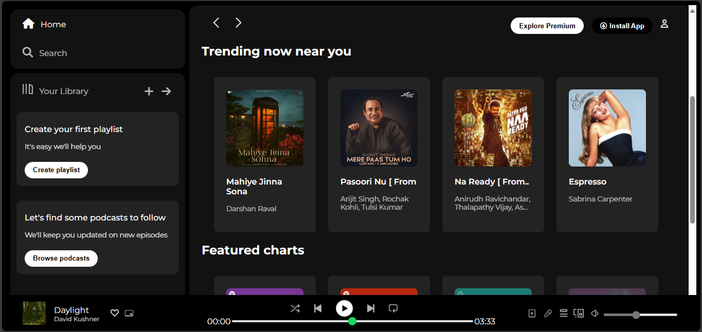

# 🎵 Spotify Clone (HTML & CSS)

A simple, responsive **Spotify Web UI Clone** built using **HTML5** and **CSS3**. This project replicates the visual look and feel of the Spotify web player, focusing purely on frontend UI without any backend or JavaScript functionality.

---

## 📸 Screenshot



## 🎯 Features

- 🎧 Clean and familiar Spotify-like layout
- 🖼️ Sidebar navigation (Home, Search, Library)
- 📝 Playlist section
- 🎶 Song list UI
- ⏯️ Footer music controls layout
- 💻 Fully responsive design

---

## 🚀 Getting Started

To run this project locally:

1. Clone the repository:
   ```bash
   git clone https://github.com/tanushkapatil/Spotify-Clone.git
